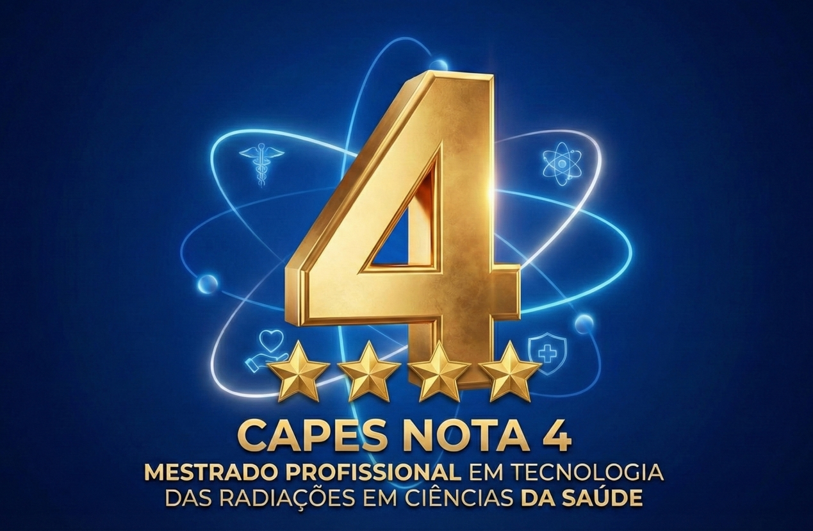

::: {.column-screen}
{width=100% style="max-height: 600px; object-fit: cover;" alt="Banner panorâmico mostrando ambientes de radioterapia, sala de aula e representação abstrata de lasers e células."}
:::

::: {.column-screen .text-white .py-5 style="background: linear-gradient(135deg, #021a40 0%, #000b1a 100%);"}

::: {.container}
::: {.grid .align-items-center}

::: {.g-col-12 .g-col-lg-6 .text-center .mb-4 .mb-lg-0}
{.img-fluid .rounded style="max-height: 450px; box-shadow: 0 0 40px rgba(0, 0, 0, 0.5);"}
:::

::: {.g-col-12 .g-col-lg-6}
<h2 class="display-5 fw-bold text-warning mb-3">Excelência Confirmada!</h2>

  O IPEN celebra uma conquista histórica. Atingimos a <strong>Nota 4</strong> na Avaliação Quadrienal da CAPES, consolidando a qualidade do nosso ensino e o impacto das nossas pesquisas na sociedade.

  <a href="institucional/noticias/nota-4-capes.qmd" class="btn btn-warning btn-lg fw-bold text-dark px-4 shadow">
    <i class="bi bi-star-fill"></i> Ler a Notícia
  </a>
  <a href="edital.qmd" class="btn btn-outline-light btn-lg px-4">
    <i class="bi bi-arrow-right-circle"></i> Participe do Processo Seletivo
  </a>

:::

:::
:::

:::

::: {.container .my-5}

# O Programa

::: {.lead .text-muted}
Bem-vindo ao Programa de Pós-Graduação Mestrado Profissional em Tecnologia das Radiações em Ciências da Saúde. Reconhecido pela CAPES (Portaria nº 60/2019), nosso objetivo é impulsionar sua carreira através do aprofundamento técnico e científico.
:::

Voltado para graduados em Medicina, Farmácia, Biomedicina, Odontologia, Física Médica, Engenharias e áreas afins, o curso capacita profissionais para o desenvolvimento, implementação e uso inovador de técnicas que utilizam radiações (ionizantes e não ionizantes) em diagnósticos, terapias e aplicações diversas na saúde moderna.

:::

::: {.container-fluid .bg-light .py-5 .my-5 style="border-top: 1px solid #dee2e6; border-bottom: 1px solid #dee2e6;"}
::: {.container .text-center}
<h2 class="display-5 fw-bold text-primary mb-3">Inscrições Abertas para Turma 2026</h2>
<h3 class="display-6 fw-bold text-primary mb-4">Curso Presencial</h3>

Não perca a oportunidade de se especializar com excelência. Consulte as regras e prazos no edital.

<a href="edital.qmd" class="btn btn-primary btn-lg px-5 fw-bold shadow-sm" role="button">Acessar Edital e Inscrições</a>
:::
:::

::: {.container .my-5 .py-4}

<h2 class="text-center border-bottom pb-3 mb-5">Áreas de Concentração</h2>

::: {.grid .align-items-center .mb-5 .gy-4}
::: {.g-col-12 .g-col-md-6}
### Processos de Radiação na Saúde

Foco no aprofundamento dos princípios físicos e biológicos das interações das radiações. Esta área abrange desde o planejamento complexo de radioterapia avançada (IMRT, VMAT, Radiocirurgia) até o uso terapêutico de lasers em reabilitação e procedimentos clínicos, preparando o profissional para otimizar tratamentos com eficácia e segurança.
:::
::: {.g-col-12 .g-col-md-6}
{.rounded .shadow width=100% alt="Ilustração abstrata unindo radioterapia, diagnóstico e lasers."}
:::
:::

::: {.grid .align-items-center .mb-5 .gy-4}
::: {.g-col-12 .g-col-md-6 .order-2 .order-md-1}
{.rounded .shadow width=100% alt="Ilustração abstrata de um coração humano, moléculas radioativas e detectores digitais."}
:::
::: {.g-col-12 .g-col-md-6 .order-1 .order-md-2}
### Medicina Nuclear e Radiofarmácia

Esta área dedica-se à cadeia completa dos radiofármacos para diagnóstico (SPECT/PET) e terapia. Os alunos exploram desde a produção de radioisótopos em cíclotrons e geradores, passando pela síntese e controle de qualidade em radiofarmácia, até a aplicação clínica e os aspectos regulatórios da medicina nuclear personalizada.
:::
:::

::: {.grid .align-items-center .mb-5 .gy-4}
::: {.g-col-12 .g-col-md-6}
### Avaliação de Tecnologias em Saúde (ATS)

Em um cenário de rápida inovação, a ATS é crucial para a gestão eficiente. Esta concentração capacita o profissional a analisar sistematicamente as implicações clínicas, econômicas, sociais e éticas da adoção de novas tecnologias radiológicas, fornecendo subsídios baseados em evidências para a tomada de decisão estratégica em saúde.
:::
::: {.g-col-12 .g-col-md-6}
{.rounded .shadow width=100% alt="Infográfico abstrato mostrando conexão entre equipamentos médicos, análise de dados e balança de decisão."}
:::
:::

